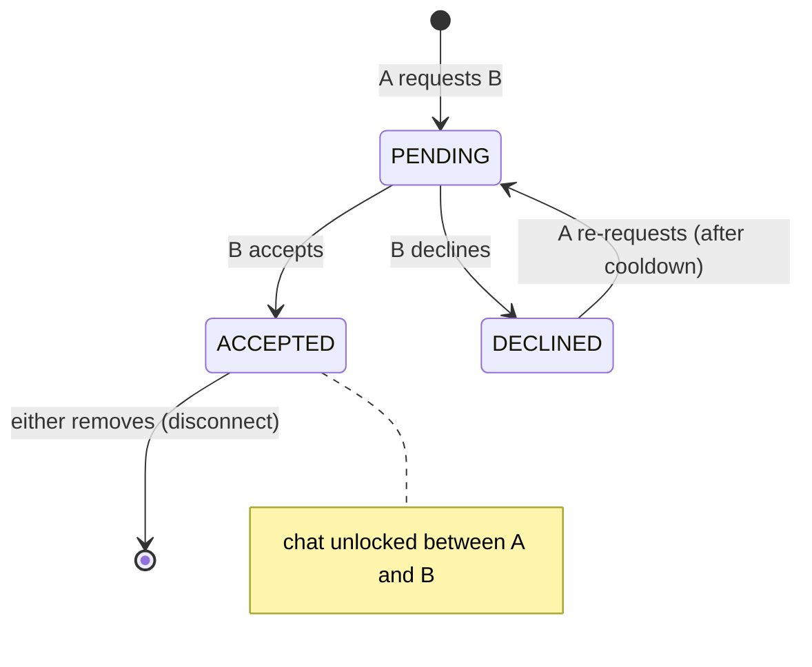
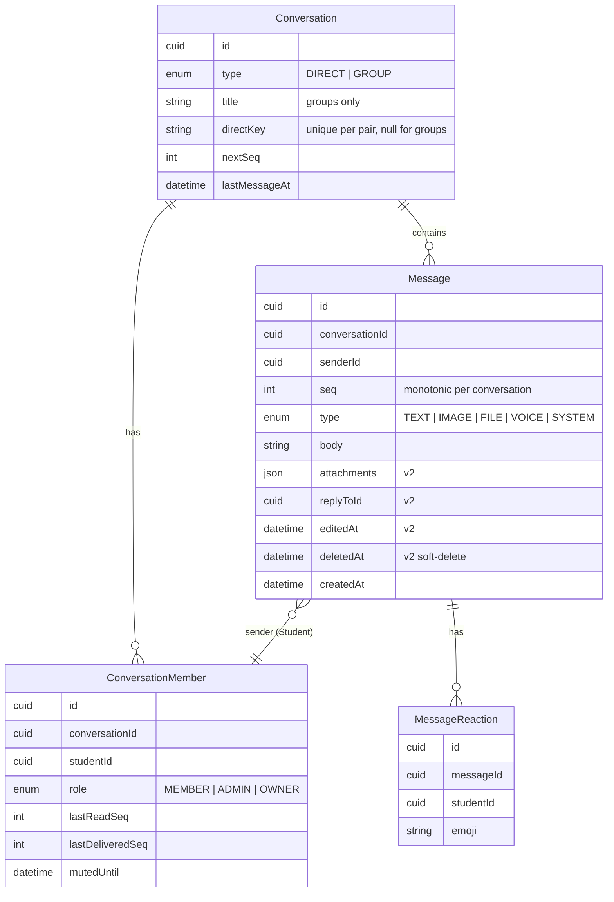
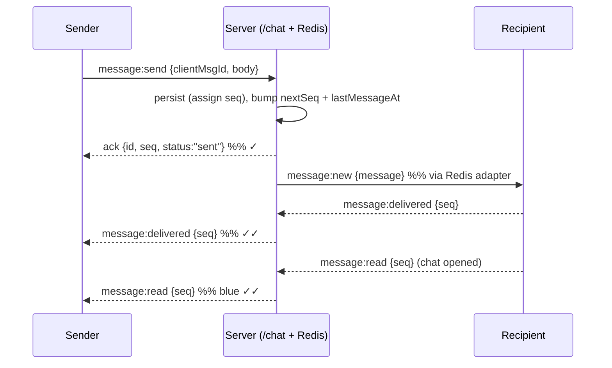

# Chat & Connections — design decisions (ElonUz backend)

**Status:** settled — v1 approved, ready for implementation planning. This doc is the **contract handed to the mobile (KMP) team**. Feeds the **connections** + **chat** modules.
**Context:** Student ↔ student messaging on the ElonUz student app. Access is **connection-gated** (LinkedIn-style): you connect first, then you can chat. Real-time over WebSocket, messages persisted in Postgres, presence/typing in Redis. Two account types exist (`students`, `business_owners`) — chat is **students only** (a business token is rejected on the socket). See `CLAUDE.md` and `docs/architecture/auth.md`.

**Two subsystems, phased build:**
1. **Connections** — the social graph (request → accept/decline → connected; remove; block). The *gate* for chat.
2. **Chat** — 1:1 messaging (v1), rich messaging (v2), groups + advanced (v3). "Telegram feel" delivered in curated phases, not all at once.

The doc describes the **full vision**; implementation ships **v1 first**.

---

## Decisions

### C1 — Access model: LinkedIn-style symmetric connections
- A **connection** is a symmetric relationship created by a directional **request**: A requests → B **accepts** (now connected) or **declines**. No follower/following (asymmetric) model.
- **You may only chat a student you are connected with.** No connection → no DM. This is the core anti-spam and privacy guarantee.
- **Reverse-request shortcut:** if B already has a pending request to A and A sends a request to B, it is treated as an **accept** (auto-connect) — mirrors LinkedIn.
- **Block** overrides everything: a block hides both users from each other and prevents requests and messages in both directions.

### C2 — Transport: Socket.IO + Redis adapter  ✅ *decided*
- **Chosen: Socket.IO** (`@nestjs/websockets` + `@nestjs/platform-socket.io`), one namespace **`/chat`**. Gives rooms, automatic reconnection with backoff, per-event **acks** (send-confirmation), and multi-instance fan-out via **`@socket.io/redis-adapter`** (Redis already present).
- **Mobile client:** Socket.IO clients — Android `io.socket:socket.io-client`, iOS `socket.io-client-swift`, bridged in KMP via `expect/actual` (there is no pure-common Socket.IO client). All events below are plain JSON, so a shared serialization layer stays common.
- Considered and rejected: raw WebSocket (Ktor, pure-KMP) — simpler client but we'd hand-roll reconnection, acks and the Redis fan-out; not worth it given Socket.IO gives them for free.

### C3 — Conversation model: unified `Conversation` + `ConversationMember`
- One model for **DIRECT** (2 members) and **GROUP** (N members, v3), rather than a separate DM table. Future-proofs groups with no migration churn.
- A DIRECT conversation is **unique per pair** (enforced by a deterministic `directKey`) and **created lazily** on the first message (or eagerly on connection-accept — see C9).

### C4 — Message ordering: per-conversation monotonic `seq`
- Every message gets a **`seq`** (1, 2, 3 …) unique within its conversation, assigned server-side in the insert transaction (increment `Conversation.nextSeq`). `createdAt` is for display; **`seq` is the ordering + cursor authority**.
- Enables cheap **pagination** (`before=seq`), **unread counts** (`seq > lastReadSeq`) and **read/delivery cursors** without per-message rows.

### C5 — Delivery & read state: per-member cursors (WhatsApp-style)
- `ConversationMember` holds **`lastDeliveredSeq`** and **`lastReadSeq`** — not a row per (message × recipient). Cheap and enough for 1:1 and groups.
- 1:1 states shown to the sender: **sent** (persisted, acked) → **delivered** (recipient's socket received it) → **read** (recipient opened the chat and advanced `lastReadSeq`). Telegram's ✓ / ✓✓ / blue-✓✓.

### C6 — Send reliability: WS-primary + REST fallback + `clientMsgId` idempotency
- The client sends over the socket and receives an **ack** carrying the canonical `{ id, seq, createdAt }`. A **`clientMsgId`** (client-generated) makes sends **idempotent** — a retry after a flaky reconnect never duplicates.
- A **REST** `POST …/messages` mirrors the same use-case for when the socket is down; it also runs the same idempotency check.

### C7 — Presence & typing: ephemeral in Redis
- **Online presence** lives in Redis (`presence:{studentId}` with a socket refcount + TTL), never Postgres. **`Student.lastSeenAt`** is persisted on disconnect for "last seen".
- **Typing** is a transient broadcast (`typing:start/stop`) — never stored.
- Presence/last-seen is shown **only to connections** (privacy).

### C8 — Offline notifications: unread counts in v1; push (FCM/APNs) later  ✅ *decided*
- v1 relies on **unread counts** returned by the conversation list + a socket event when the app reconnects. Real **push** to a backgrounded device (FCM/APNs) is deferred — the `notifications` module is an empty scaffold; wiring it is its own task.

### C9 — Disconnect keeps history read-only
- Removing a connection (or a block) **stops new messages** but **keeps the existing conversation + history** (read-only). Reconnecting re-opens it. History is never destroyed by a disconnect.

### C10 — Abuse limits
- Connection **requests**: rate-limited per requester; a **cooldown** before re-requesting after a decline; a hard cap on outstanding outgoing requests.
- Messages: rate-limited per sender; max body length; only into conversations where the caller is a member **and** (for DIRECT) an **active** connection exists.

### C11 — Discovery: search by full name **and** username  ✅ *decided*
- `Student` gains a **`username`** column — **unique**, case-insensitive, `@map("username")`, editable in the student profile (`profiles` module). Nullable until set; a student without a username is still discoverable by name.
- **`GET /v1/students/search?q=`** matches `q` against **username** (prefix) **or** **full name** (`firstName`/`lastName`, case-insensitive contains). Results exclude blocked users and the caller, and carry the connection status per result (`NONE | PENDING_OUT | PENDING_IN | CONNECTED`) so the app can render the right button.
- **Student summary** (the shape returned wherever a person appears — search, connections, conversation members): `{ id, username, fullName, avatarUrl, online, lastSeenAt }`. `online`/`lastSeenAt` are only populated for connections (C7 privacy).

### C12 — Reporting: report a user or a message (anti-scam)  ✅ *decided*
- Block (C1) hides one person; **Report** feeds moderation and catches repeat offenders. Companion to block — a user can both block **and** report in one action.
- **`POST /v1/reports`** `{ targetStudentId? , messageId? , reason, note? }` — exactly one target (a student **or** a message). `reason` ∈ `SPAM | SCAM | HARASSMENT | INAPPROPRIATE | OTHER`. Rate-limited; duplicate open reports by the same reporter against the same target are coalesced.
- Stored in a **`Report`** table (`reporterId`, target, `reason`, `note`, `status = OPEN | REVIEWED | ACTIONED | DISMISSED`, `createdAt`). Reporting a message snapshots its content so a later delete can't hide evidence.
- **v1 = capture only** (submit + persist). The moderation dashboard + auto-flag on a report threshold live in the `admin` module (later). The connection-gate already stops unsolicited DMs; block + report complete the safety story.

---

## Connections subsystem

### State machine



`Block` is a separate directional edge that supersedes any connection state.

### Data model (Prisma)

```
Connection {
  id           cuid  @id
  requesterId  -> Student
  addresseeId  -> Student
  status       enum(PENDING, ACCEPTED, DECLINED)
  createdAt
  respondedAt?
  @@unique([requesterId, addresseeId])   // app also blocks the reverse duplicate
}

Block {
  id          cuid @id
  blockerId   -> Student
  blockedId   -> Student
  createdAt
  @@unique([blockerId, blockedId])
}
```
`connected(A,B)` := an `ACCEPTED` `Connection` with `{A,B}` in either direction **and** no `Block` between them.

### REST endpoints (BaseResponse envelope, Uzbek messages)

| Method | Path | Purpose |
|--------|------|---------|
| `GET`  | `/v1/students/search?q=` | Discover students by **username or full name** (paginated); each result carries `connectionStatus` |
| `POST` | `/v1/connections/requests` `{ addresseeId }` | Send a request (or auto-accept a reverse-pending one) |
| `GET`  | `/v1/connections/requests?direction=incoming\|outgoing` | Pending requests (paginated) |
| `POST` | `/v1/connections/requests/{id}/accept` | Accept |
| `POST` | `/v1/connections/requests/{id}/decline` | Decline |
| `GET`  | `/v1/connections` | My accepted connections (paginated) |
| `DELETE` | `/v1/connections/{studentId}` | Disconnect |
| `POST` | `/v1/blocks` `{ studentId }` · `DELETE /v1/blocks/{studentId}` | Block / unblock |
| `POST` | `/v1/reports` `{ targetStudentId? , messageId? , reason, note? }` | Report a user or a message (C12) — feeds moderation |

---

## Chat subsystem

### Data model (Prisma)


- `@@unique([conversationId, seq])` and `@@unique([conversationId, studentId])`. `directKey` unique. `nextSeq` incremented in the send transaction.
- **Unread for a member** = `count(messages where seq > lastReadSeq and senderId != me)`.

### Real-time protocol (namespace `/chat`, JWT on handshake)

Auth: the socket handshake carries the **access JWT** (`auth: { token }`); the gateway validates it with the same `JwtService` → `studentId`, rejecting non-student tokens. Each socket joins a room per conversation it belongs to.

**Client → Server**
| Event | Payload | Ack |
|-------|---------|-----|
| `message:send` | `{ conversationId, clientMsgId, type, body, replyToId? }` | `{ clientMsgId, id, seq, createdAt, status:"sent" }` |
| `message:read` | `{ conversationId, seq }` | — |
| `message:delivered` | `{ conversationId, seq }` | — |
| `typing:start` / `typing:stop` | `{ conversationId }` | — |

**Server → Client**
| Event | Payload |
|-------|---------|
| `message:new` | `{ conversationId, message }` |
| `message:delivered` | `{ conversationId, seq, byStudentId }` |
| `message:read` | `{ conversationId, seq, byStudentId }` |
| `typing` | `{ conversationId, studentId, isTyping }` |
| `presence:update` | `{ studentId, online, lastSeenAt }` |
| `connection:request` / `connection:accepted` | `{ from/with student }` (real-time social notifications) |

### Send sequence (1:1)



### REST endpoints (history / list / fallback)

| Method | Path | Purpose |
|--------|------|---------|
| `GET`  | `/v1/conversations` | List (last message + `unreadCount`), newest-active first, paginated |
| `GET`  | `/v1/conversations/{id}` | Conversation + members |
| `GET`  | `/v1/conversations/{id}/messages?before={seq}&size=` | History (paginated, `seq`-cursor) |
| `POST` | `/v1/conversations/{id}/messages` | Send (REST fallback; same idempotency) |
| `POST` | `/v1/conversations/{id}/read` `{ seq }` | Advance read cursor |
| *(v2)* | `PUT /v1/messages/{id}` · `DELETE /v1/messages/{id}` · `POST /v1/messages/{id}/reactions` | Edit / delete / react |

REST follows the project envelope (`BaseResponse`, `{ items, page, size, total, hasNext }`, ISO-8601, Uzbek `message`). WS events use their own documented JSON schema (not envelope-wrapped).

---

## Feature phasing → Telegram mapping

| Phase | Features |
|-------|----------|
| **v1 — core** | Connections (request/accept/decline/remove/block/**report**, discovery search) · 1:1 text over WS · delivery/read receipts · typing · online + last-seen presence · unread counts · conversation list · history pagination |
| **v2 — rich** | Media (image → file → voice; reuses `media/upload`) · reply/quote · edit · delete (me / everyone) · emoji reactions · message search · pin · mute |
| **v3 — advanced** | **Group chats** (create, members, roles, add/remove) · forward · stickers/GIF · polls |
| **Out of scope (separate project / maybe never)** | Voice/video calls (WebRTC + TURN) · channels · bots |

---

## Architecture

- **Modules:** `src/modules/connections/` (new) and `src/modules/chat/` (fill the scaffold), each DDD-layered (`domain` / `application` / `infrastructure` / `presentation`). The WS gateway is a `presentation` adapter of `chat`.
- **Packages to add:** `@nestjs/websockets`, `@nestjs/platform-socket.io`, `socket.io`, `@socket.io/redis-adapter`. `ioredis` + `RedisService` already exist.
- **Prisma additions to existing models** (one migration): `Student.username` (unique, nullable) and `Student.lastSeenAt`. New tables: `Connection`, `Block`, `Report`, `Conversation`, `ConversationMember`, `Message` (+ `MessageReaction` in v2).
- **Scaling:** the Redis adapter fans out `message:new` etc. across app instances so multi-device / multi-replica delivery works. Presence lives in Redis.
- **Auth:** reuse the JWT + `AccountType.STUDENT` guard on both REST and the socket handshake. Ownership/connection checks in the application layer.

---

## Resolved decisions

1. **Transport (C2):** ✅ **Socket.IO** + Redis adapter. Mobile uses the Android/iOS Socket.IO clients bridged in KMP.
2. **Discovery (C11):** ✅ search by **username *and* full name**; `Student` gains a unique `username` (editable in profile).
3. **Offline push (C8):** ✅ v1 = unread counts only; real FCM/APNs push is a later task.

**Deferred (specced when the phase starts):** group ownership/roles and add/remove rules (v3); media storage specifics for voice/file (v2, reuses `media/upload`); report moderation dashboard + auto-flag on a report threshold (`admin` module, later — v1 only captures reports).
